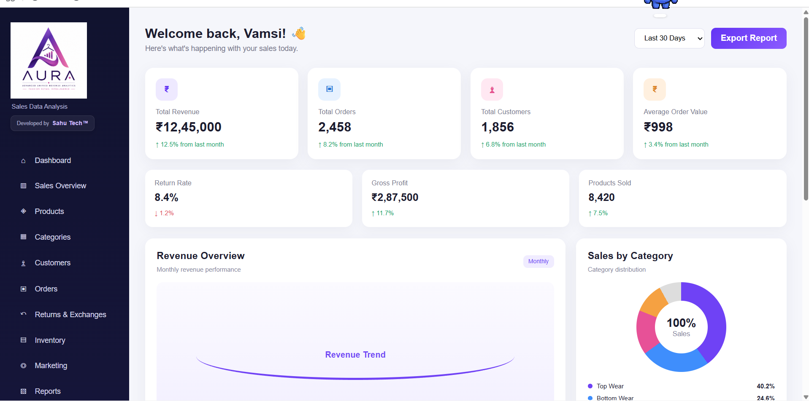

````md
# AURA

## Advanced User Recommendation & Analytics

**AURA** is a modular retail analytics platform developed using Python, Flask, Pandas, NumPy, Matplotlib, Seaborn, and ReportLab.

The project transforms retail data into useful analytics, recommendations, visualizations, dashboard insights, and downloadable reports through a structured multi-engine architecture.

> **Developed by Sahu Tech™**
---

## Dashboard Preview



---
---

## Overview

AURA is designed as an end-to-end sales data analysis system.

The platform combines:

- Data processing
- Statistical analytics
- Product recommendations
- Data visualization
- Report generation
- Flask-based dashboard
- PDF export
- Retail business insights

The frontend works as the presentation layer while Python remains responsible for the main data-processing and analytical operations.

---

## Project Architecture

```text
                         AURA
                           │
                           ▼
                     RAW DATASET
                           │
                           ▼
                     DATA ENGINE
                           │
              ┌────────────┼────────────┐
              ▼            ▼            ▼
           Loading     Validation     Cleaning
                           │
                           ▼
                   Duplicate Removal
                           │
                           ▼
                   ANALYTICS ENGINE
                           │
             ┌─────────────┼─────────────┐
             ▼             ▼             ▼
          Summary      Statistics    Correlation
                           │
                           ▼
                RECOMMENDATION ENGINE
                           │
         ┌─────────────────┼─────────────────┐
         ▼                 ▼                 ▼
   Content Based     Collaborative     Personalized
                           │
                           ▼
                 VISUALIZATION ENGINE
                           │
      ┌────────┬────────┬────────┬────────┬─────────┐
      ▼        ▼        ▼        ▼        ▼         ▼
     Bar      Line      Pie    Scatter Histogram  Heatmap
                           │
                           ▼
                    REPORTING ENGINE
                           │
               ┌───────────┼───────────┐
               ▼           ▼           ▼
              CSV        Excel        PDF
                           │
                           ▼
                    FLASK DASHBOARD
                           │
                           ▼
                        USER
````

---

## Project Objectives

The main objectives of AURA are to:

* Load and process structured sales data.
* Validate dataset availability and structure.
* Handle missing values.
* Detect and remove duplicate records.
* Analyze numerical and categorical data.
* Calculate statistical measures.
* Study correlations between variables.
* Identify sales and product patterns.
* Generate product recommendations.
* Identify trending products.
* Find similar products.
* Generate personalized recommendations.
* Create meaningful visualizations.
* Generate downloadable reports.
* Present insights using a Flask dashboard.
* Provide a simple interface suitable for academic demonstration.

---

## Current Project Status

| Component                          | Status       |
| ---------------------------------- | ------------ |
| Data Engine                        | ✅ Completed  |
| Analytics Engine                   | ✅ Completed  |
| Recommendation Engine              | ✅ Completed  |
| Visualization Engine               | ✅ Completed  |
| Reporting Engine                   | ✅ Completed  |
| Backend Modules                    | ✅ 35/35      |
| Main Pipeline                      | ✅ Working    |
| Dataset Processing                 | ✅ Working    |
| CSV Reporting                      | ✅ Working    |
| Excel Reporting                    | ✅ Working    |
| PDF Reporting                      | ✅ Working    |
| Flask Dashboard                    | ✅ Developed  |
| Dashboard Navigation               | ✅ Working    |
| Existing Visualization Integration | ✅ Working    |
| PDF Export from Dashboard          | ✅ Working    |
| Graph Integration in PDF           | ✅ Working    |
| AURA Branding                      | ✅ Integrated |
| Sahu Tech™ Branding                | ✅ Integrated |

---

## Technology Stack

| Technology | Purpose                        |
| ---------- | ------------------------------ |
| Python     | Core programming language      |
| Flask      | Dashboard and web routing      |
| Pandas     | Data manipulation and analysis |
| NumPy      | Numerical operations           |
| Matplotlib | Data visualization             |
| Seaborn    | Statistical visualization      |
| ReportLab  | PDF generation                 |
| OpenPyXL   | Excel report support           |
| HTML       | Dashboard structure            |
| CSS        | Dashboard styling              |
| CSV        | Dataset storage                |
| Git        | Version control                |
| GitHub     | Repository hosting             |

---

# Backend Architecture

AURA contains five main backend engines.

```text
AURA Backend
│
├── Data Engine
├── Analytics Engine
├── Recommendation Engine
├── Visualization Engine
└── Reporting Engine
```

The backend currently contains:

```text
Data Engine                4 Modules
Analytics Engine           9 Modules
Recommendation Engine      8 Modules
Visualization Engine       8 Modules
Reporting Engine           6 Modules

-----------------------------------
TOTAL                      35 Modules
-----------------------------------
```

---

# Project Structure

```text
AURA/
│
├── .gitignore
├── .vscode/
│
├── Core/
│   ├── analytics.py
│   ├── data.py
│   ├── recommendation.py
│   ├── reporting.py
│   ├── utils.py
│   └── visualization.py
│
├── Dashboard/
│   ├── app.py
│   │
│   ├── static/
│   │   ├── css/
│   │   │   └── style.css
│   │   │
│   │   └── images/
│   │       └── AURA.png
│   │
│   └── templates/
│       ├── alerts.html
│       ├── base.html
│       ├── categories.html
│       ├── customers.html
│       ├── dashboard.html
│       ├── help.html
│       ├── inventory.html
│       ├── marketing.html
│       ├── orders.html
│       ├── products.html
│       ├── reports.html
│       ├── returns.html
│       ├── sales.html
│       └── settings.html
│
├── Dataset/
│   └── Raw/
│       └── AURA.csv
│
├── Documentation/
│
├── Engines/
│   │
│   ├── Data/
│   │   ├── load_dataset.py
│   │   ├── validate_dataset.py
│   │   ├── clean_missing.py
│   │   └── remove_duplicates.py
│   │
│   ├── Analytics/
│   │   ├── summary.py
│   │   ├── data_types.py
│   │   ├── mean.py
│   │   ├── median.py
│   │   ├── mode.py
│   │   ├── minimum.py
│   │   ├── maximum.py
│   │   ├── standard_deviation.py
│   │   └── correlation.py
│   │
│   ├── Recommendation/
│   │   ├── category_recommendation.py
│   │   ├── collaborative_filtering.py
│   │   ├── content_based.py
│   │   ├── personalized_recommendation.py
│   │   ├── recommendation_score.py
│   │   ├── recommendation_summary.py
│   │   ├── similar_products.py
│   │   └── trending_products.py
│   │
│   ├── Visualization/
│   │   ├── bar_chart.py
│   │   ├── box_plot.py
│   │   ├── heatmap.py
│   │   ├── histogram.py
│   │   ├── line_chart.py
│   │   ├── pie_chart.py
│   │   ├── scatter_plot.py
│   │   └── visualization_summary.py
│   │
│   └── Reporting/
│       ├── export_logs.py
│       ├── generate_csv.py
│       ├── generate_excel.py
│       ├── generate_pdf.py
│       ├── report_manager.py
│       └── report_summary.py
│
├── reports/
│
├── main.py
├── README.md
└── requirements.txt
```

---

# Data Engine

The Data Engine prepares the dataset before analysis.

## Modules

### `load_dataset.py`

Loads the main dataset:

```text
Dataset/Raw/AURA.csv
```

into a Pandas DataFrame.

### `validate_dataset.py`

Checks whether the dataset has been successfully loaded.

### `clean_missing.py`

Detects and removes rows containing missing values.

### `remove_duplicates.py`

Detects duplicate records and removes them from the dataset.

---

# Analytics Engine

The Analytics Engine performs statistical analysis on the processed dataset.

## Modules

* Summary
* Data Types
* Mean
* Median
* Mode
* Minimum
* Maximum
* Standard Deviation
* Correlation

Example:

```python
average_price = dataset["Price"].mean()
```

The Analytics Engine helps understand distributions, variations, numerical patterns, and relationships between dataset attributes.

---

# Recommendation Engine

The Recommendation Engine provides different recommendation methods for retail analysis.

## Available Recommendation Modules

* Content-Based Recommendation
* Collaborative Filtering
* Similar Products
* Trending Products
* Category Recommendation
* Personalized Recommendation
* Recommendation Score
* Recommendation Summary

Example recommendation score:

```text
Recommendation Score =
(Sales / Maximum Sales) × 100
```

This engine helps identify products that may be relevant based on sales, categories, product relationships, and customer purchase patterns.

---

# Visualization Engine

AURA includes a dedicated Visualization Engine.

The visualization logic remains inside the backend and is reused by other parts of the project.

## Available Visualizations

* Bar Chart
* Line Chart
* Pie Chart
* Scatter Plot
* Histogram
* Box Plot
* Heatmap
* Visualization Summary

The dashboard does not need to recreate these visualizations separately.

Instead, the project follows:

```text
AURA.csv
   │
   ▼
Visualization Engine
   │
   ▼
Matplotlib / Seaborn Graph
   │
   ├──────────────► Analysis
   │
   └──────────────► PDF Report
```

This keeps the architecture modular and avoids unnecessary duplication.

---

# Reporting Engine

The Reporting Engine generates analytical outputs in different formats.

## Supported Report Types

* CSV
* Excel
* PDF
* Logs
* Report Summary

The project also includes dashboard-based PDF export.

---

# Flask Dashboard

AURA includes a Flask-based dashboard for presenting analytical information.

The dashboard is located inside:

```text
Dashboard/
```

The Flask application is located at:

```text
Dashboard/app.py
```

---

## Dashboard Pages

The interface currently contains:

* Dashboard
* Sales Overview
* Products
* Categories
* Customers
* Orders
* Returns & Exchanges
* Inventory
* Marketing
* Reports
* Alerts
* Settings
* Help & Support

---

# Dashboard Features

The main dashboard contains:

* Total Revenue
* Total Orders
* Total Customers
* Average Order Value
* Return Rate
* Gross Profit
* Products Sold
* Revenue Overview
* Sales by Category
* Top Selling Products
* Top Cities by Revenue
* Key Insights
* Recent Alerts
* Export Report

The interface uses a clean purple AURA theme with a sidebar layout and reusable HTML templates.

---

# Dashboard Architecture

```text
Browser
   │
   ▼
Flask Application
   │
   ├──────────────► HTML Templates
   │
   ├──────────────► CSS Styling
   │
   ▼
AURA Backend
   │
   ├── Data Engine
   ├── Analytics Engine
   ├── Recommendation Engine
   ├── Visualization Engine
   └── Reporting Engine
   │
   ▼
Dataset/Raw/AURA.csv
```

---

# PDF Export

The dashboard includes an **Export Report** feature.

When the user selects:

```text
Export Report
```

the request is handled by Flask.

The system then uses the existing AURA backend and Visualization Engine to generate a downloadable PDF report.

```text
User
  │
  ▼
Export Report
  │
  ▼
Flask Route
  │
  ▼
AURA Dataset
  │
  ▼
Existing Visualization Engine
  │
  ▼
ReportLab
  │
  ▼
PDF Report
```

---

## PDF Report Content

The generated report can include:

* Dataset summary
* Dataset row count
* Dataset column count
* Dataset column information
* Product sales bar chart
* Sales trend line chart
* Category distribution pie chart
* Price vs Sales scatter plot
* Histogram
* Box plot
* Correlation heatmap

The graphs are generated through the existing Visualization Engine instead of creating separate duplicate chart logic inside the Flask dashboard.

---

# Frontend Design

The frontend uses:

```text
HTML
+
CSS
+
Flask Templates
```

No complex frontend framework is required.

The frontend was intentionally kept understandable for academic demonstration while maintaining a polished interface.

---

# AURA Branding

The dashboard uses the official AURA visual identity.

The AURA logo is located at:

```text
Dashboard/static/images/AURA.png
```

The dashboard follows a dark sidebar and purple-accent interface.

---

# Sahu Tech™

AURA is developed under the:

## **Sahu Tech™**

developer brand.

Sahu Tech™ branding is integrated into the dashboard interface and project presentation.

```text
AURA
Sales Data Analysis

Developed by Sahu Tech™
```

---

# Running AURA

## 1. Clone the Repository

```bash
git clone https://github.com/TECHIEVK007/AURA.git
```

---

## 2. Enter the Project Folder

```bash
cd AURA
```

---

## 3. Install Dependencies

```bash
pip install -r requirements.txt
```

---

## 4. Run the Main Backend

```bash
python main.py
```

---

## 5. Run the Flask Dashboard

```bash
python Dashboard/app.py
```

---

## 6. Open the Dashboard

Open:

```text
http://127.0.0.1:5000
```

in a browser.

---

# Main Dependencies

AURA uses packages including:

```text
Flask
Pandas
NumPy
Matplotlib
Seaborn
ReportLab
OpenPyXL
```

They can be installed manually using:

```bash
pip install flask pandas numpy matplotlib seaborn reportlab openpyxl
```

However, using:

```bash
pip install -r requirements.txt
```

is recommended.

---

# Basic Workflow

```text
START
  │
  ▼
Load Dataset
  │
  ▼
Validate Dataset
  │
  ▼
Clean Missing Data
  │
  ▼
Remove Duplicates
  │
  ▼
Perform Analytics
  │
  ▼
Generate Recommendations
  │
  ▼
Create Visualizations
  │
  ▼
Generate Reports
  │
  ▼
Display Dashboard
  │
  ▼
END
```

---

# Design Principles

AURA follows a few important development principles.

## Modular Architecture

Each major operation is separated into individual modules.

This makes the system easier to:

* Maintain
* Test
* Explain
* Extend

---

## Reusable Backend

The same backend modules can be reused by:

* `main.py`
* Flask dashboard
* Visualization system
* Reporting system

This avoids creating unnecessary duplicate logic.

---

## Simple Frontend

The frontend is intentionally kept simple enough to understand and explain while maintaining a professional interface.

---

## Explainable System

AURA is designed so that individual modules can be explained independently during academic demonstrations.

---

# Academic Scope

AURA is an academic sales data analysis project.

The dataset is used for:

* Learning
* Demonstration
* Data analysis
* Visualization
* Recommendation experiments

The values shown in the project should be interpreted as analytical results based on the project dataset.

They should not be represented as verified financial information from a real-world company.

---

# Repository

GitHub Repository:

```text
https://github.com/TECHIEVK007/AURA
```

---

# Future Enhancements

Possible future improvements include:

* Fully dynamic dashboard KPIs
* Dashboard filters
* Dynamic date filtering
* Recommendation controls
* Recommendation search
* Interactive visualizations
* Advanced customer analysis
* Advanced inventory analysis
* Database integration
* User authentication
* Cloud deployment
* Responsive mobile interface
* Enhanced PDF reports
* Live report generation
* API integration
* Extended recommendation models
* Advanced business intelligence features

---

# Final Architecture

```text
                AURA
                  │
      ┌───────────┼───────────┐
      ▼           ▼           ▼
 Data Engine   Analytics   Recommendation
      │           │           │
      └───────────┼───────────┘
                  ▼
          Visualization Engine
                  │
                  ▼
           Reporting Engine
                  │
                  ▼
           Flask Dashboard
                  │
                  ▼
                 User
```

---

# Final Note

AURA combines:

```text
Data Processing
       +
Statistical Analytics
       +
Recommendations
       +
Visualizations
       +
Reporting
       +
Flask Dashboard
```

into one modular retail analytics platform.

## **AURA — Turning Data into Insights.**

### **Developed by Sahu Tech™**

```
```
